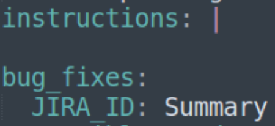
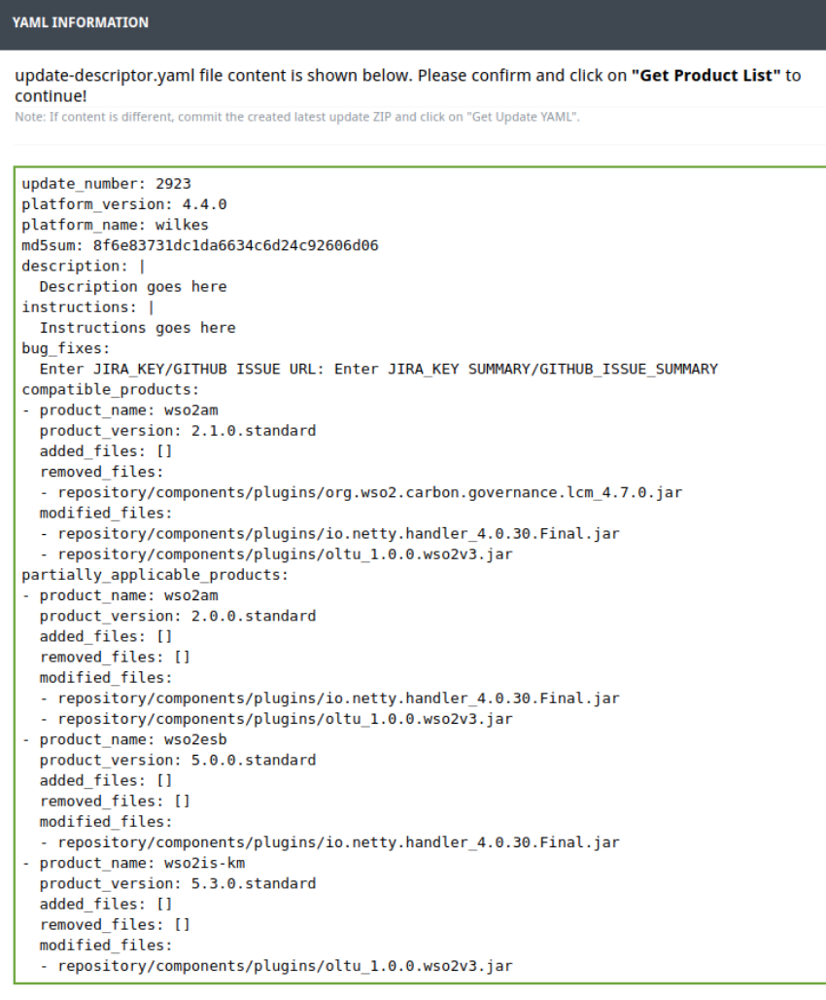
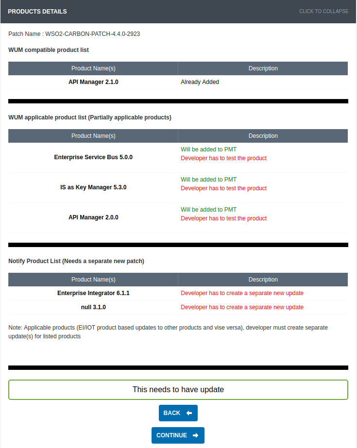
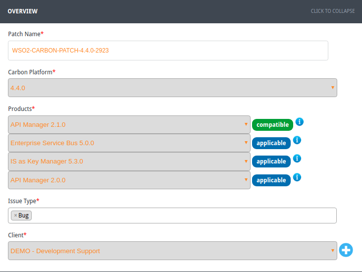

# Developer Guide

The WSO2 Update Creator tool (wum-uc) is designed to help you create and
validate updates that are compatible with
[WUM.](https://medium.com/@shan1024/wum-wso2-update-manager-97e0578a49ba#.aomo1cmf0) It
is written in [GO](https://golang.org/) language. As a result, you can
compile the code directly to machine code without using the JVM. Cross
compiling is also possible.

This document describes how to use the  Update Creator tool to create an
update directly or convert a patch to an update.

Before you begin, here are the descriptions of the files used in this
guide. The wum-uc tool generates both these files.

{.expand-control-image}update-descriptor3.yaml
file

This is a newly introduced file that contains details about the update
that complies with WUM 3.0.0 . Every update has an
`         update-descriptor3.yaml       ` file. It has details about the
products that this update is fully or partially compatible with, the
file changes (added, removed, or modified), descriptions, and
instructions.

A sample file looks like the following:

``` java
update_number: 2922
platform_version: 4.4.0
platform_name: wilkes
md5sum: 8f6e83731dc1da6634c6d24c92606d06
description: |
  Details about the update for wso2am-2.1.0.standard
  Details about the update for wso2am-2.0.0.standard
  Details about the update for wso2esb-5.0.0.standard
  Details about the update for wso2is-km-5.3.0.standard
instructions: |
  Instructions for wso2am-2.1.0.standard
  Instructions for wso2am-2.0.0.standard
  Instructions for wso2esb-5.0.0.standard
  Instructions for wso2is-km-5.3.0.standard
bug_fixes:
  JIRA_ID: Summary
compatible_products:
- product_name: wso2am
  product_version: 2.1.0.standard
  added_files: []
  removed_files:
  - repository/components/plugins/org.wso2.carbon.governance.lcm_4.7.0.jar
  modified_files:
  - repository/components/plugins/io.netty.handler_4.0.30.Final.jar
  - repository/components/plugins/oltu_1.0.0.wso2v3.jar
partially_applicable_products:
- product_name: wso2am
  product_version: 2.0.0.standard
  added_files: []
  removed_files: []
  modified_files:
  - repository/components/plugins/io.netty.handler_4.0.30.Final.jar
  - repository/components/plugins/oltu_1.0.0.wso2v3.jar
- product_name: wso2esb
  product_version: 5.0.0.standard
  added_files: []
  removed_files: []
  modified_files:
  - repository/components/plugins/io.netty.handler_4.0.30.Final.jar
- product_name: wso2is-km
  product_version: 5.3.0.standard
  added_files: []
  removed_files: []
  modified_files:
  - repository/components/plugins/oltu_1.0.0.wso2v3.jar
```

In WUM 2.0.0, we used update-descriptor.yaml . The reason to introduce a
new file in WUM 3.0.0 is because WUM 3.0.0 s upports partial updates.
For example, in the above sample, the update numbered 2922 gets fully
applied to `         wso2am-2.1.0.standard       ` product while it gets
partially applied to `         wso2am-         2.0.0.standard       ` ,
wso2esb-5.0.0.standard, and `         wso2is-km-5.3.0.standard       `
products.

You should manually fill in the description, instructions, and the
bug\_fixes fields of the `         update-descriptor3.yaml       ` file
according to the products listed in it. W hen filling the description
and instructions sections of an update that gets fully or partially
applied to multiple products, use paragraphs to separate the description
per product. Be careful not to break the initial indentation though as
that results in a malformed YAML.

Given below is an example of a description that has multiple paragraphs:

``` java
description: |
   Details about the update for wso2am-2.1.0.standard, this paragraph only contains details regarding wso2am-2.1.0.standard 
   Details about the update for wso2am-2.0.0.standard, this paragraph only contains details regarding wso2am-2.0.0.standard
   Details about the update for wso2esb-5.0.0.standard, this paragraph only contains details regarding wso2esb-5.0.0.standard
   Details about the update for wso2is-km-5.3.0.standard, this paragraph only contains details regarding wso2is-km-5.3.0.standard
```

Here's an example of a malformed YAML. The malformation is caused by
YAML treating the entire sentence 'Details about the update for
wso2am-2.0.0.standard, this paragraph only contains details regarding
wso2am-2.0.0.standard' as a key.

The same applies to the instructions field as well.

``` java
description: |
   Details about the update for wso2am-2.1.0.standard, this paragraph only contains details regarding wso2am-2.1.0.standard 
   Details about the update for wso2am-2.0.0.standard, this paragraph only contains details regarding wso2am-2.0.0.standard
```

If there are no bug fixes, enter N/A in the `         JIRA_ID       `
and `         Summary       ` fields. I f there are no instructions,
leave a blank line as follows:

{width="150"}

Note that you do not manually modify the `added_files` and
`             modified_files           ` sections like in the previous
versions of the tool. They are added automatically by the tool.

In cases where the version of a JAR file is updated, remove the old JAR
file and provide path to the removed file when prompted by the wum-uc
tool .

{.expand-control-image}update-descriptor.yaml
file

**This file will be discontinued when WUM 2.0.0 gets deprecated.**

The update-descriptor.yaml file is used to identify update details by
WUM 2.0.0. It will get created by the wum-uc tool along with the
previous YAML file until wum 2.0.0 gets deprecated. You will be prompted
to provide inputs for applies\_to, bug\_fixes, and description fields.

Given below is a sample update-descriptor.yaml file:

``` java
update_number: 2922
platform_version: 4.4.0
platform_name: wilkes
applies_to: wso2das-3.1.0
bug_fixes:
  JIRA_ID: Summary
description: Details about the update for wso2das-3.1.0
file_changes:
  added_files: []
  removed_files:
  - repository/components/plugins/org.wso2.carbon.governance.lcm_4.7.0.jar
  modified_files:
  - repository/components/plugins/io.netty.handler_4.0.30.Final.jar
  - repository/components/plugins/oltu_1.0.0.wso2v3.jar
```

If there are no bug fixes, enter N/A in the `         JIRA_ID       `
and `         Summary       ` fields.

Let's start using the Update Creator tool.

-   [Download the tool](#DeveloperGuide-Downloadthetool)
-   [Set the environment
    variables](#DeveloperGuide-Settheenvironmentvariables)
-   [Build the tool (optional)](#DeveloperGuide-Buildthetool(optional))
-   [Initialize the tool](#DeveloperGuide-Initializethetool)
-   [Create an update directly](#DeveloperGuide-Createanupdatedirectly)
-   [Commit the created ZIP file to
    SVN](#DeveloperGuide-CommitthecreatedZIPfiletoSVN)
-   [Convert old patches to
    WUM-updates](#DeveloperGuide-ConvertoldpatchestoWUM-updates)

### Download the tool

Go to [the release section of
GitHub](https://github.com/wso2/update-creator-tool/releases) to
download the tool.

### Set the environment variables

1.  If you want to run the tool from anywhere, add it to the system PATH
    variable. For example, this is the command for Ubuntu:

    ``` java
    export PATH=$PATH:[ENTER_PATH_TO_BIN_HERE]
    ```

2.  Set the LICENSE\_MD5 environment variable: 

    ``` java
    LICENSE_MD5=84d7cad403ae420940cd0f62bec1b520
    ```

### Build the tool (optional)

Follow the steps below if you want to built the tool yourself.

1.  Download GO from [its official website](https://golang.org/) and
    install it. You need GO to compile and run this tool.
2.  Run the following command to download and install the packages along
    with their dependencies:

    ``` java
    go get -u github.com/wso2/update-creator-tool
    ```

3.  Open the `update-creator-tool/constant/constants.go` file of the
    cloned repository and replace the value of the constant
    `BASE64_ENCODED_CONSUMER_KEY_AND_SECRET` with the following: 

    ``` java
    BASE64_ENCODED_CONSUMER_KEY_AND_SECRET= "N01ENDRMM21HcVhrOTlXTDM2N19na1lPNTgwYTpVaEQxSzlwbzVDUF9BaExLUFhUS3Bqc0FMbU1h"
    ```

4.  Run `       build.sh     `  to generate the executable files for
    various OS/architecture combinations. These files are located in the
    `build/target/` directory.
5.  Extract the relevant ZIP file to your OS/architecture.
6.  Find the executable wum-uc file in the bin directory.

### Initialize the tool

1.  Run the following command to initialize wum-uc:

    ``` java
    wum-uc init
    ```

2.  When prompted, give your WSO2 username and password.

3.  Note that the .wum-uc directory is created. Let's call it in this
    guide.

### Create an update directly

Follow below steps to create an update.

1.  Create a directory (let's call this ) and copy the following
    files that need to be in your update:

    -   All updated files (e.g., binary and resource files).
    -   The instructions.txt (required only till WUM 2.0 gets
         depreciated).

    **Note**: **Do not copy** `LICENSE.txt` and `NOT_A_CONTRIBUTION.txt`
    as they get automatically added bythe tool.

2.  Run the following command to create the update:

    ``` java
    wum-uc create <update_dir> <dist_loc>

    // <update_dir>: the path to <UPDATE_LOCATION> 
    // <dist_loc>: path to the latest WUM-updated distribution that you obtained by pointing WUM to the live environment (i.e., 'url: https://api.updates.wso2.com')
    ```

3.  Give the relevant update number when prompted. 

4.  When prompted, select the relevant platform version that you are
    creating the update for.

    ``` java
    Select the platform name and version from following: 
     1. wilkes   4.4.0
     2. hamming   5.0.0
    Enter your preference [1/2]:
    ```

5.  When prompted for removed files:

    -   Press 'n' if no files are removed from this update. 
    -   Press 'y' for adding removed files and enter the path of the
        removed files relative to .

6.  When you are done with adding removed files, press 'Enter' without
    any inputs. 

7.  When prompted, confirm that you are done adding inputs by pressing
    'y' for yes or 'n' for no.

8.  Enter the following when prompted. Note that these are required only
    until  WUM 2.0  gets depreciated. 

    -   The names of product/s for the 'applies to' field.
    -   The JIRA keys and summaries relevant to the update. (Press
        'Enter' when you are done).
    -   The description for the created update.

9.  Note that the update ZIP is created in the location from where you
    execute wum-uc. The tool displays a summary of the update creation.

    {.expand-control-image}Click to
    see an example...

    Here's an example:

    ``` java
    'update-descriptor.yaml' has been successfully created in '/home/kasun/Documents/wum-uc/demo'.
    Optional resource file 'instructions.txt' not copied.
    'update-descriptor3.yaml' has been successfully created in '/home/kasun/Documents/wum-uc/demo'.
    'WSO2-CARBON-UPDATE-4.4.0-2923.zip' successfully created.

    Your update applies to the following products
     Compatible products : [wso2am] 
     Partially applicable products : [wso2esb wso2is-km wso2am] 
     Notify products : [wso2ei wso2iot] 
    Manually fill the 'description','instructions' and 'bug_fixes' fields for above products in the update-descriptor3.yaml located inside the created 'WSO2-CARBON-UPDATE-4.4.0-2923.zip'
    ```

    As shown in the `Notify products` field of the above summary, the
    update can be applied to the products wso2ei and wso2iot as well.
    However, due to the differences in the directory structures of the
    above products, it is the responsibility of the developer to create
    seperate updates for them in the `Notify products` field.

### Commit the created ZIP file to SVN

Before commiting the file, do a manual inspection of its directory
structure and the entries in the `update-descriptor3.yaml` and
`update-descriptor.yaml` files. For Wilkes, the update repository
location is
<https://svn.wso2.com/wso2/custom/projects/projects/carbon/wilkes/updates>.

1.  When changing the lifecycle state of the created update from
    Development to Staging, you see a newly added check as follows.
    Click it.{width="200"}
2.  You get directed to a seperate page as follows: 
3.  Click **GET UPDATE YAML** to see the YAML information as follows:  
    {width="500"}
4.  Verify the YAML information and click **GET PRODUCT LIST** to see
    the product details as follows:  
    {width="550"}
5.  Verify the product details and click CONTINUE.
6.  You get a page as follows. Update it with the products relevant for
    your update number.  
    {width="600"}

Some samples for the `     UPDATE_LOCATION   ` directory are shown
below:

{.expand-control-image}Sample 1

``` java
├── axis2_1.6.1.wso2v16.jar
├── instructions.txt
├── LICENSE.txt
├── NOT_A_CONTRIBUTION.txt
├── synapse-core_2.1.5.wso2v2.jar
├── update-descriptor3.yaml
└── update-descriptor.yaml
```

{.expand-control-image}Sample 2

``` java
├── LICENSE.txt
├── NOT_A_CONTRIBUTION.txt
├── oauth2.war
├── update-descriptor3.yaml
└── update-descriptor.yaml
```

{.expand-control-image}Sample 3

``` java
├── LICENSE.txt
├── NOT_A_CONTRIBUTION.txt
├── org.wso2.carbon.apimgt.hostobjects_5.0.3.jar
├── store
│   ├── modules
│   │   └── subscription
│   │       ├── list.jag
│   │       └── module.jag
│   └── site
│       └── blocks
│           └── subscription
│               └── subscription-list
│                   ├── ajax
│                   │   └── subscription-list.jag
│                   └── block.jag
├── update-descriptor3.yaml
└── update-descriptor.yaml
```

{.expand-control-image}Sample 4

``` java
├── bin
│   └── tomcat-juli-7.0.69.jar
├── lib
│   └── endorsed
│       └── tomcat-annotations-api-7.0.69.jar
├── LICENSE.txt
├── org.wso2.carbon.tomcat_4.4.3.jar
├── tomcat_7.0.59.wso2v3.jar
├── tomcat-catalina-ha_7.0.59.wso2v1.jar
├── tomcat-el-api_7.0.59.wso2v1.jar
├── tomcat-jsp-api_7.0.59.wso2v1.jar
├── tomcat-servlet-api_7.0.59.wso2v1.jar
├── NOT_A_CONTRIBUTION.txt
├── update-descriptor3.yaml
└── update-descriptor.yaml
```

### Convert old patches to WUM-updates

-   [Sample 1: Basic scenario](#DeveloperGuide-Sample1:Basicscenario)
-   [Sample 2: Update with resource
    files](#DeveloperGuide-Sample2:Updatewithresourcefiles)
-   [Sample 3: When the patch has config
    changes](#DeveloperGuide-Sample3:Whenthepatchhasconfigchanges)

#### Sample 1: Basic scenario

Let's convert the `WSO2-CARBON-PATCH-4.4.0–0001.zip` to the WUM update
format.

1.  Extract the `WSO2-CARBON-PATCH-4.4.0–0001.zip`. We call this
    location `<` `PatchDir>`.
2.  Note that the structure of the is as follows:

    ``` java
    PatchDir
    └── WSO2-CARBON-PATCH-4.4.0–0001
      ├── LICENSE.txt
      ├── NOT_A_CONTRIBUTION.txt
      ├── patch0001
      │ └── hazelcast_3.5.0.wso2v1.jar
      ├── README.txt
      └── wso2carbon-version.txt
    ```

    All the file changes are in `<`
    `PatchDir>/WSO2-CARBON-PATCH-4.4.0–0001/patch0001`.

3.  Copy the content of the `patch0001` directory to
    `WSO2-CARBON-PATCH-4.4.0–0001` directory (parent directory of
    `       patch0001     ` directory) and delete` patch0001` directory.
4.  Delete wso2carbon-version.txt, LICENSE.txt, and
    `       NOT_A_CONTRIBUTION.txt     ` files from the above directory.
5.  Note that the new directory structure looks as follows:

    ``` java
    ── WSO2-CARBON-PATCH-4.4.0–0001
      ├── hazelcast_3.5.0.wso2v1.jar
      ├── README.txt
    ```

6.  Follow the update creation process mentioned above to create the
    update.
7.  Note that if successful, the c reated
    `       WSO2-CARBON-UPDATE-4.4.0–0001.zip     ` should be located at
    the current working directory. You can validate this using the 
    `       wum-uc validate      ` command.

#### Sample 2: Update with resource files

Follow the steps below to convert WSO2-CARBON-PATCH-4.4.0–0237.zip to
WUM update format. 

1.  Extract the WSO2-CARBON-PATCH-4.4.0–0237.zip file. We call this
    location . 
2.  Note that the structure of the is as follows. Read the README.txt
    for more information about the patch.

    ``` java
    WSO2-CARBON-PATCH-4.4.0-0237
     ├── bin
     │  └── tomcat-juli-7.0.69.jar
     ├── lib
     │  └── endorsed
     │      └── tomcat-annotations-api-7.0.69.jar
     ├── LICENSE.txt
     ├── patch0237
     │  ├── org.wso2.carbon.tomcat_4.4.1.jar
     │  ├── tomcat_7.0.59.wso2v3.jar
     │  ├── tomcat-catalina-ha_7.0.59.wso2v1.jar
     │  ├── tomcat-el-api_7.0.59.wso2v1.jar
     │  ├── tomcat-jsp-api_7.0.59.wso2v1.jar
     │  └── tomcat-servlet-api_7.0.59.wso2v1.jar
     └── README.txt
    ```

3.  Move the content of the `patch0237` directory to the
    `WSO2-CARBON-PATCH-4.4.0–0237` directory and delete`patch0237`.
4.  Delete the  `       LICENSE.txt     ` file from the
    WSO2-CARBON-PATCH-4.4.0–0237   directory. 
5.  Note that the new directory structure should as follows:

    ``` java
    WSO2-CARBON-PATCH-4.4.0-0237
      ├── bin
      │ └── tomcat-juli-7.0.69.jar
      ├── instructions.txt
      ├── lib
      │ └── endorsed
      │     └── tomcat-annotations-api-7.0.69.jar
      ├── org.wso2.carbon.tomcat_4.4.1.jar
      ├── README.txt
      ├── tomcat_7.0.59.wso2v3.jar
      ├── tomcat-catalina-ha_7.0.59.wso2v1.jar
      ├── tomcat-el-api_7.0.59.wso2v1.jar
      ├── tomcat-jsp-api_7.0.59.wso2v1.jar
      ├── tomcat-servlet-api_7.0.59.wso2v1.jar
    ```

6.  Follow the update creation process mentioned above to create the
    update.
7.  Note that, if successful, the  WSO2-CARBON-UPDATE-4.4.0–0237.zip
     file will be created in the current working directory. You can
    validate it using the  wum-uc validate command.

#### Sample 3: When the patch has config changes

Follow the steps below to convert the WSO2-CARBON-PATCH-4.4.0–0478.zip
file to new WUM update format when the patch has configuration changes.

1.  Extract the patch and move the content of the patch0478 directory to
    the parent directory.

    ``` java
    WSO2-CARBON-PATCH-4.4.0-0478
     ├── LICENSE.txt
     ├── NOT_A_CONTRIBUTION.txt
     ├── README.txt
     ├── synapse-core_2.1.5.wso2v2.jar
     └── update-descriptor.yaml
    ```

2.  Note in the `README.txt` that there are configuration changes added
    in this patch. 

    You need to add these instructions in an `instructions.txt` file
    until WUM 2.0 gets officially deprecated. After it is deprecated,
    same content above should be added to the instructions field of the
    new `update-descriptor3.yaml` file after successfully creating the
    update.

    {.expand-control-image}Expand
    to see a sample instructions.txt file...

    ``` java
    When the org.wso2.carbon.identity.mgt.IdentityMgtEventListener is enabled via <EventListeners> configuration in repository/conf/identity/identity.xml, it engages CacheClearingUserOperationListener which clears the policy cache.

    This should be configurable through <EventListeners> configuration.

    This step is optional, and is only required if you need to disable the immediate cache invalidation.

    Copy following xml content into identity.xml as the very first element under the <EventListeners> element.

    <EventListener 
    type="org.wso2.carbon.user.core.listener.UserOperationEventListener" name="org.wso2.carbon.identity.entitlement.listener.CacheClearingUserOperationListener" 
    orderId="6" enable="false"
    />
    ```

3.  Note that the new directory structure looks as follows:

    ``` java
    WSO2-CARBON-PATCH-4.4.0-0478
     ├── instructions.txt
     ├── README.txt
     └── synapse-core_2.1.5.wso2v2.jar
    ```

4.  Follow the update creation process [mentioned
    above](#DeveloperGuide-Createanupdatedirectly) to create the update.
5.  Note that, if successful, the
    `         WSO2-CARBON-UPDATE-4.4.0–0478.zip       ` file will be
    created in the current working directory. You can validated it using
    the  `         wum-uc validate        ` command.

## Attachments:

{width="8" height="8"}
[overview-products.png](attachments/103318258/103318259.png)
(image/png)  
{width="8" height="8"}
[Product-details.png](attachments/103318258/103318260.png) (image/png)  
{width="8" height="8"}
[get-updated-YAML.png](attachments/103318258/103318261.png)
(image/png)  
{width="8" height="8"}
[YAML-description.png](attachments/103318258/103318262.png)
(image/png)  
{width="8" height="8"}
[blank-line.png](attachments/103318258/103318263.png) (image/png)  
{width="8" height="8"}
[image2018-8-10\_17-37-18.png](attachments/103318258/103318264.png)
(image/png)  
